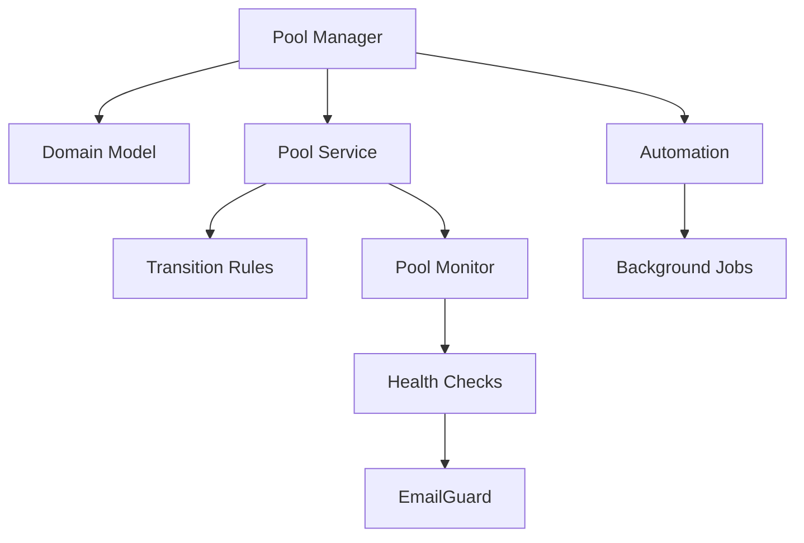

# Active Development Context

## Current Phase: Phase 2, Day 3 (Pool System Implementation)

### Development Status

#### Completed Components

1. **Models Layer**

   - Domain Model (`src/models/Domain.ts`)
   - Pool Model (`src/models/Pool.ts`)
   - User Model (`src/models/User.ts`)
   - PlacementTestResult Model (`src/models/PlacementTestResult.ts`)

2. **API Integration**
   - EmailGuard Service Implementation
   - Smartlead Client Integration
   - Rate Limiting System
   - Error Handling Patterns

#### In Progress: Pool Implementation

1. **Core Services**

   - Pool Manager (`src/services/pools/PoolManager.ts`)
   - Pool Service (`src/services/pools/PoolService.ts`)
   - Transition Rules (`src/services/pools/rules/TransitionRules.ts`)
   - Pool Monitor (`src/services/pools/monitoring/PoolMonitor.ts`)

2. **Active Development**
   - Domain State Management
   - Health Monitoring System
   - Automation Rules Engine
   - Test Scheduling System

#### Next: Automation Engine

1. **Planned Components**
   - Background Job Processor
   - Metric Collection System
   - Alert Management
   - Recovery Automation

### Known Issues

#### Critical: MongoDB ObjectId Test Failures

```typescript
// Location: src/tests/pools/__mocks__/mockServices.ts:239
// Error: "BSONError: input must be a 24 character hex string"
// Impact: 22 failed tests, 7 passed tests

// Current Implementation
function createTestDomain() {
  return {
    _id: "invalid_id", // Issue: Invalid ObjectId format
    name: "test.domain.com",
    status: "warming",
  };
}

// Required Fix
function createTestDomain() {
  return {
    _id: new ObjectId().toString(), // Fix: Proper ObjectId generation
    name: "test.domain.com",
    status: "warming",
  };
}
```

#### Test Suite Status

1. **Failed Test Suites**

   - test_domain_management.test.ts
   - test_transitions.test.ts
   - test_monitoring.test.ts

2. **Test Statistics**
   - Total Suites: 4
   - Failed Suites: 3
   - Passed Suites: 1
   - Total Tests: 29
   - Failed Tests: 22
   - Passed Tests: 7

### Active Tasks

1. **Pool System**

   - [ ] Fix ObjectId generation in test mocks
   - [ ] Complete pool transition validation
   - [ ] Implement health check scheduling
   - [ ] Add domain rotation logic

2. **Integration**

   - [ ] Finalize EmailGuard test scheduling
   - [ ] Implement Smartlead campaign integration
   - [ ] Complete rate limiter implementation
   - [ ] Add error recovery mechanisms

3. **Monitoring**
   - [ ] Set up health check system
   - [ ] Implement metric collection
   - [ ] Add alert triggers
   - [ ] Create monitoring dashboard

### Component Dependencies



### Recent Changes

1. **API Integration**

   - Added rate limiting
   - Implemented error handling
   - Added retry mechanisms
   - Completed API client tests

2. **Pool System**

   - Added state machine
   - Implemented validation rules
   - Created monitoring system
   - Added health checks

3. **Testing**
   - Added mock services
   - Created test suites
   - Implemented integration tests
   - Added E2E test framework

### Next Milestones

1. **Week 1**

   - Complete pool system
   - Fix all test failures
   - Implement monitoring

2. **Week 2**

   - Build automation engine
   - Add recovery system
   - Implement dashboards

3. **Week 3**
   - Complete integration
   - Add production safeguards
   - Deploy monitoring
